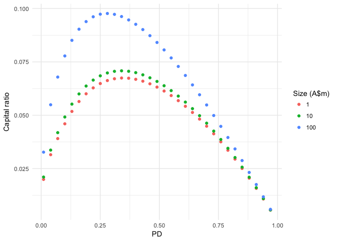

<!-- README.md is generated from README.Rmd. Please edit that file -->
creditriskr - Credit Risk Capital Tools
=======================================

You will be able to calculated credit risk capital related quantities using this package. These reflect the standards outlined in [APRA's credit risk prudential standards](http://www.apra.gov.au/adi/PrudentialFramework/Pages/prudential-standards-and-guidance-notes-for-adis.aspx), and consequently reflects the Australian implementation of the Basel III capital standards.

Retail exposures
----------------

The following illustrates the capital ratios associated with exposures with different credit risk characteristics.

``` r
library(tidyverse)
#> Loading tidyverse: ggplot2
#> Loading tidyverse: tibble
#> Loading tidyverse: tidyr
#> Loading tidyverse: readr
#> Loading tidyverse: purrr
#> Loading tidyverse: dplyr
#> Conflicts with tidy packages ----------------------------------------------
#> filter(): dplyr, stats
#> lag():    dplyr, stats
library(creditriskr)
x <- seq(0.01, 0.99, by = 0.03)
pd <- rep(x, 3)
lgd <- 0.20
sub_class <- rep(c("mortgage", "qrr", "other"), each = length(x))
k <- retail_capital(pd, lgd, sub_class)
df <- tibble(pd, lgd, sub_class, k)
ggplot(df, aes(x = pd, y = k, colour = sub_class)) + 
  geom_point() +
  theme_minimal() +
  labs(x = "PD", y = "Capital ratio", colour = "Sub-asset class")
```


Non-retail exposures
--------------------

``` r
size <- rep(c(1, 10, 100), each = length(x))
k <- non_retail_capital(pd, lgd, size, 1, FALSE)
df <- tibble(pd, lgd, size, k)
ggplot(df, aes(x = pd, y = k, colour = as.character(size))) + 
  geom_point() +
  theme_minimal() +
  labs(x = "PD", y = "Capital ratio", colour = "Size")
```


